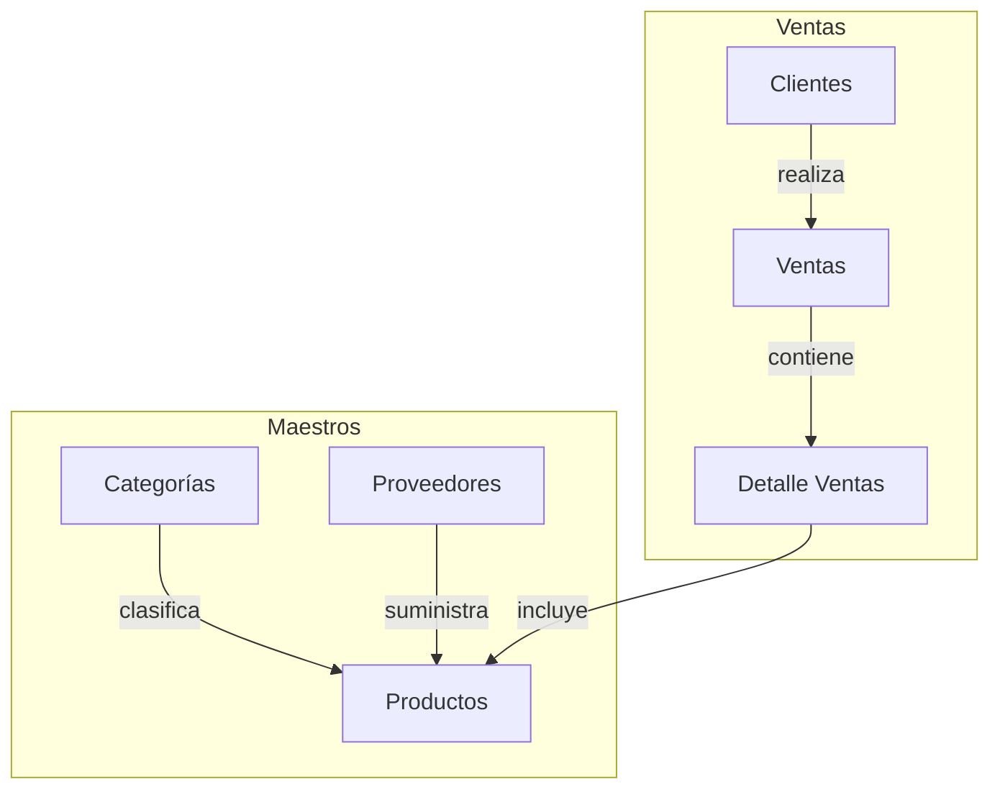

# TechZone - Sistema de Gestión de Inventario y Ventas

## 📄 Descripción del Proyecto

**TechZone** es una tienda dedicada a la venta de productos tecnológicos como laptops, teléfonos, accesorios y componentes electrónicos. Este proyecto implementa un sistema de gestión de inventario y ventas utilizando PostgreSQL para resolver los siguientes problemas:

- Errores en el control de stock
- Dificultades en el seguimiento de ventas
- Gestión manual de proveedores
- Falta de automatización en el registro de compras

El nuevo sistema permite gestionar eficientemente productos, ventas, clientes y proveedores.

---

## 🖼️ Modelo Entidad-Relación


## 🖼️ Diagrama flujo


---

## 📁 Estructura del Repositorio
```
TechZone-DB/
├── modelo_er.png                # Diagrama E-R del sistema
├── db.sql                       # Script de creación de tablas
├── insert.sql                   # Datos de prueba para cada entidad
├── queries.sql                  # Consultas avanzadas
├── procedureAndFunctions.sql    # Procedimiento almacenado de ventas
└── README.md                    # Documentación del proyecto
```

---

## 📃 Archivos Incluidos

### 1. `db.sql`
Contiene la estructura de la base de datos:
- Tablas: productos, clientes, ventas, detalle_ventas, proveedores, categorias
- Claves primarias y foráneas
- Restricciones: `NOT NULL`, `CHECK`, `UNIQUE`

### 2. `insert.sql`
Incluye al menos 15 registros por tabla con datos realistas:
- Productos con diferentes categorías y proveedores
- Clientes con correos electrónicos reales (@gmail.com)
- Ventas y detalles de ventas simuladas

### 3. `queries.sql`
Contiene 6 consultas avanzadas:
1. Productos con stock menor a 5 unidades
2. Ventas totales de un mes específico
3. Cliente con más compras
4. Top 5 productos más vendidos
5. Ventas en un rango de fechas (3 días y 1 mes)
6. Clientes que no han comprado en los últimos 6 meses

### 4. `procedureAndFunctions.sql`
Incluye un procedimiento almacenado `registrar_venta_proc`:
- Valida si el cliente existe
- Verifica el stock antes de procesar
- Si no hay stock: lanza error con `RAISE`
- Si hay stock: registra la venta y actualiza el inventario
- Incluye control transaccional con `BEGIN`, `EXCEPTION`, `COMMIT`

---

## ⚙️ Instrucciones para Ejecutar en PostgreSQL

### 1. Crear la base de datos:
```sql
CREATE DATABASE techzone;
```

### 2. Conectarse a la base de datos:
```sql
\c techzone
```

### 3. Ejecutar scripts:
```sql
-- Crear tablas
\i db.sql

-- Insertar datos de prueba
\i insert.sql

-- Crear funciones y procedimientos
\i procedureAndFunctions.sql

-- Consultas avanzadas
\i queries.sql
```

---

## 🔍 Ejemplo: Ejecutar una Compra (Procedure)
```sql
CALL registrar_venta_proc(
    1,                    -- ID del cliente
    ARRAY[10, 3],          -- IDs de productos
    ARRAY[1, 2]           -- Cantidades respectivas
);
CALL registrar_venta_proc(
    1,                    -- ID del cliente
    ARRAY[5, 1],          -- IDs de productos
    ARRAY[1, 2]           -- Cantidades respectivas
);
CALL registrar_venta_proc(
    1,                    -- ID del cliente
    ARRAY[2, 3],          -- IDs de productos
    ARRAY[1, 1]           -- Cantidades respectivas
);
CALL registrar_venta_proc(
    1,                    -- ID del cliente
    ARRAY[3, 2],          -- IDs de productos
    ARRAY[2, 5]           -- Cantidades respectivas
);
```
- Si el cliente o el producto no existen, o si no hay stock, lanza un error.
```sql
ERROR:  ? Stock insuficiente para el producto ID 2: disponible 2, solicitado 5.
```
- Si la operación es válida, registra la venta y actualiza el stock.
```sql
NOTICE:  ? Venta registrada correctamente. ID: 8
```
---

### 🌟 Proyecto desarrollado como parte del examen final del curso de bases de datos.

🚨 **Estado del Ejercicio**  
Culminado.  

👤 **Autor**  
Jhorman Jesús Castellanos Morales  

---
